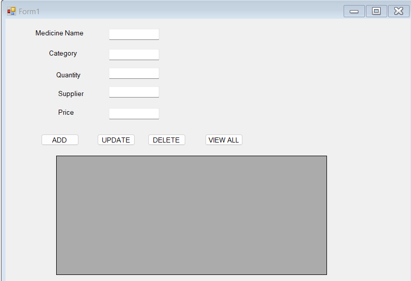
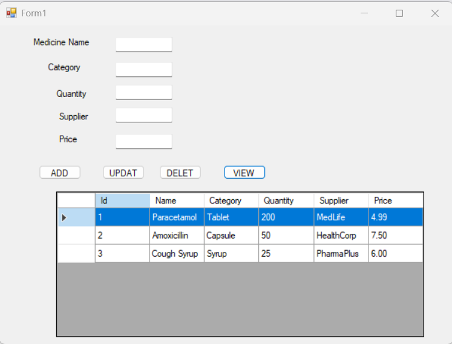
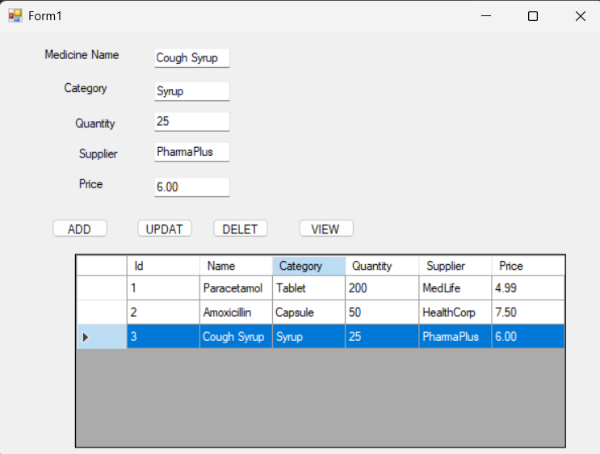

# 🧾 Pharmacy Inventory Manager - WinForms Project

## 📌 Project Overview

A lightweight, pharmacy-focused inventory management system built using **C# WinForms**, simulating a real-world pharmacy environment. Allowing users to **Add**, **Update**, **Delete**, and **View** medicines, along with persistent **CSV file storage** to retain data between sessions.

---

## 🎯 Purpose of the Project

* To simulate pharmacy workflows and showcase understanding of **user experience**, **scalability**, and **maintenance**.
* To reflect experience in **C#**, **WinForms**, and **Microsoft SQL principles**, with modular, clean code.

---

## 🏗️ Features Implemented

| Feature            | Description                                                                      |
| ------------------ | -------------------------------------------------------------------------------- |
| `Add Medicine`     | Add a new medicine with name, category, quantity, supplier, and price.           |
| `View Medicines`   | View all records in a `DataGridView` with column autofit and full row selection. |
| `Update Medicine`  | Auto-fills form on row click. Updates record after modifying any field.          |
| `Delete Medicine`  | Deletes a selected row using ID.                                                 |
| `Data Persistence` | Uses CSV file (`medicine_inventory.csv`) for save/load.                          |
| `Form Auto-fill`   | On selecting a row, all textboxes fill with that record’s data.                  |

---

## 🔗 Architecture & Integration

### ✅ Files Created:

* `Medicine.cs` — Model class (POCO) for medicine entity.
* `MedicineService.cs` — Business logic layer with add, update, delete, save, and load.
* `Form1.cs` — UI logic: button click handlers and UI-data connection.
* `Form1.Designer.cs` — Auto-generated UI layout.
* `medicine_inventory.csv` — Persistent storage of medicine data.

### ✅ Code Flow:

1. `Form1.cs` handles UI interactions.
2. Calls to `MedicineService.cs` execute logic.
3. Data is stored in a list and synced to CSV file.
4. App reads from CSV on launch to preload all data.

### ✅ Event Linkages:

| Control        | Linked Method                                    |
| -------------- | ------------------------------------------------ |
| `btnAdd`       | `btnAdd_Click()`                                 |
| `btnView`      | `btnView_Click()`                                |
| `btnUpdate`    | `btnUpdate_Click()`                              |
| `btnDelete`    | `btnDelete_Click()`                              |
| `dgvMedicines` | `dgvMedicines_CellClick()` (auto-fill textboxes) |

---

## 🧠 Logic Breakdown

### MedicineService.cs

* List-based storage (`List<Medicine> _medicines`)
* File IO: `SaveToFile()` and `LoadFromFile()` using `System.IO`
* Incremental ID management

### Form1.cs

* CRUD operations bound to buttons
* `DataGridView` updates on demand
* Uses `ClearFields()` to reset form state

---

## 📸 Screenshot Areas

## 🏆 Skills Demonstrated 

| Skill/Concept             | Implementation in the project                           |
| ------------------------- | -----------------------------------------------------   |
| .NET, C#, WinForms        | Used C# with WinForms to build a structured desktop app |
| SDLC participation        | Applied modular design with clear separation of concerns|
| Clean, maintainable code  | Used service and model layers for logic and structure   |
| Bug fixing & enhancements | Implemented field auto-fill, CSV saving, and validation |
| Understanding workflows   | Pharmacy-like data structure with real-world terms      |
| Microsoft SQL Server      | Simulated with in-memory + CSV (local DB alternative)   |
| REST API integration      | (Not applicable here, but extensible)                   |
| Version control readiness | GitHub repository with organized commits and structure  |
| UX and usability          | Simple UI with DataGridView, labels, and autofill       |
| Fast-paced execution      | Built complete CRUD system in short cycle               |
| Strong problem solving    | Identified and fixed update/input issues                |

---
## ✅ Outcome

* Fully functional WinForms CRUD app
* Mimics real pharmacy inventory use-case
* Reusable and extensible C# structure

## 📁 Features which soon will be updated to project

* Integrate with MS SQL Server or SQLite
* Add RESTful API for external data access
* Authentication and roles (pharmacist, admin)
* Export to Excel or PDF
* Sort and filter by category or price

